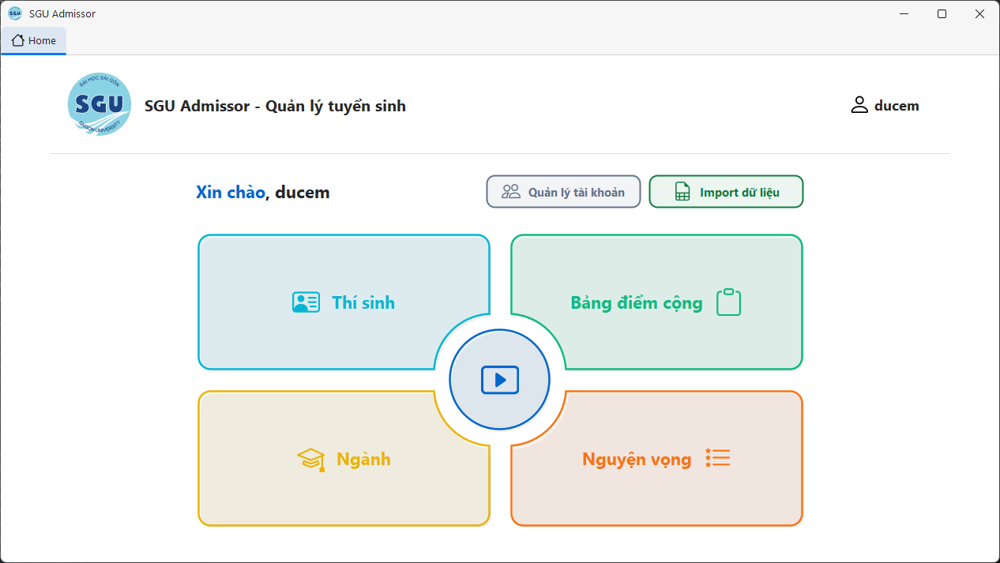
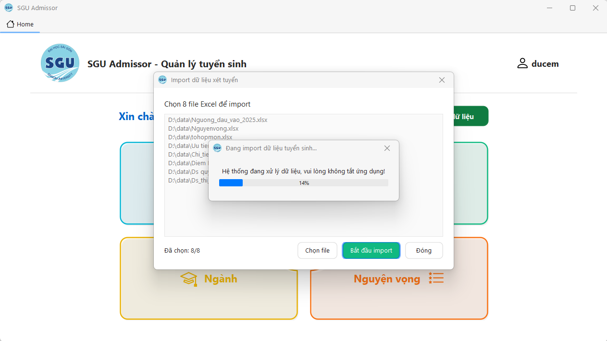
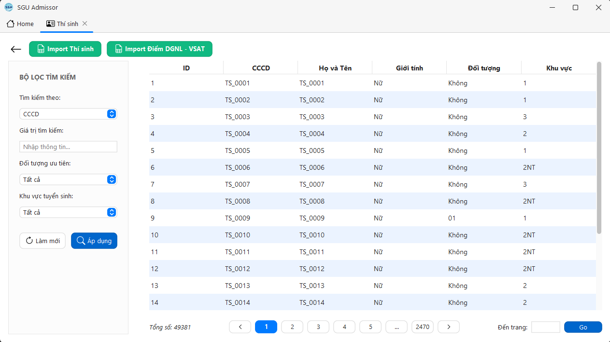
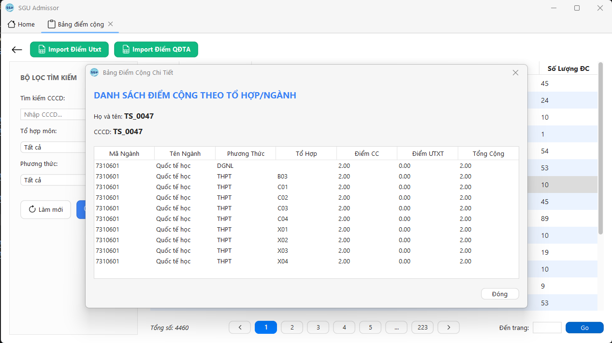
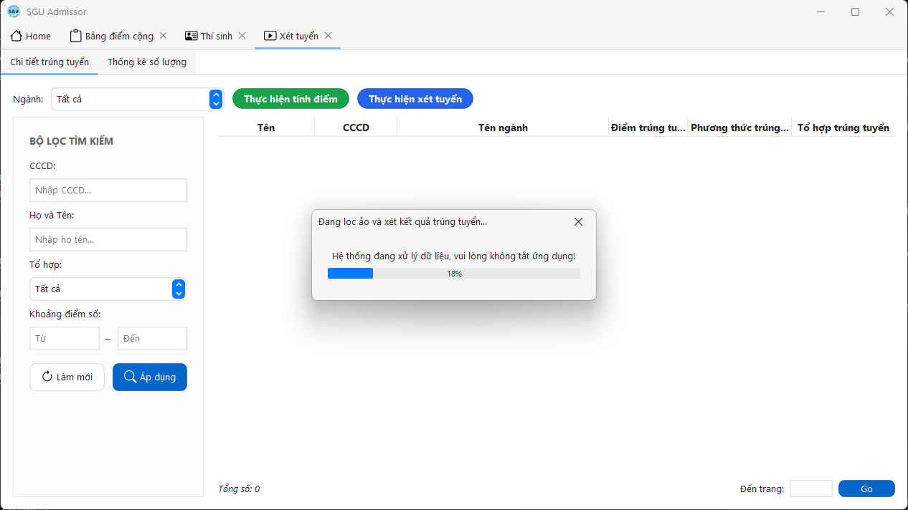

# 📦 SGU Admissor


## 🌟 Điểm nổi bật

- Tự động hóa hoàn toàn quy trình xử lý dữ liệu tuyển sinh quy mô lớn (hơn 49.000 thí sinh và hơn 100.000 nguyện vọng).
- Tự động khởi tạo nguyện vọng hợp lệ theo phương thức tuyển sinh của thí sinh và tự tính toán điểm cộng ưu tiên, điểm quy đổi chứng chỉ ngoại ngữ.
- Thuật toán thông minh tự động tìm phương án đạt điểm xét tuyển tối ưu nhất cho thí sinh, thực hiện lọc ảo chính xác theo chỉ tiêu tuyển sinh 2025 của SGU.
- Giao diện Swing phẳng hiện đại (FlatLaf), hỗ trợ bộ lọc tìm kiếm thông minh và phân trang tối ưu hiệu năng.


## ℹ️ Tổng quan

SGU Admissor là ứng dụng desktop giúp quản lý, xử lý dữ liệu và thực hiện thuật toán xét tuyển sinh Đại học hệ chính quy cho Trường Đại học Sài Gòn (SGU) theo quy chế mới năm 2025. Ứng dụng ra đời nhằm tự động hóa quy trình xét tuyển phức tạp, tối ưu hóa cơ hội trúng tuyển của thí sinh và loại bỏ hoàn toàn hồ sơ ảo chéo giữa các ngành một cách nhanh chóng và chính xác.


## 📐 Kiến trúc dự án

Dự án được xây dựng theo kiến trúc **3 lớp (3-Layer Architecture)** kết hợp với mô hình quản lý phụ thuộc (Dependency Injection) bằng **Google Guice**, giúp các thành phần trong dự án dễ dàng bảo trì, nâng cấp và kiểm thử:

```text
src/main/java/com/sgu/admissor/
├── auth/           # Quản lý phiên đăng nhập và phân quyền hệ thống (AuthSession)
├── bus/            # Tầng xử lý nghiệp vụ, tính điểm & chạy thuật toán xét tuyển (BUS)
├── dao/            # Tầng truy xuất dữ liệu JPA/Hibernate (Data Access Object - DAO)
├── dto/            # Các đối tượng chuyển giao dữ liệu tạm thời (Data Transfer Object)
├── entity/         # Các mô hình thực thể ánh xạ trực tiếp cơ sở dữ liệu MySQL (JPA Entities)
├── gui/            # Tầng giao diện người dùng (UI Layer) sử dụng Java Swing & FlatLaf
│   ├── components/ # Các thành phần UI tùy chỉnh (RoundButton, PastelButton, Avatar...)
│   ├── dialog/     # Các cửa sổ hộp thoại chức năng (Import Excel, Detail, Loading...)
│   ├── frame/      # Khung màn hình chính (MainFrame) và cửa sổ Đăng nhập (LoginFrame)
│   └── panel/      # Các phân hệ tab tính năng chính (Thí sinh, Ngành, Xét tuyển...)
├── util/           # Lớp tiện ích mở rộng (phân loại file Excel, mã hóa mật khẩu, helper...)
└── SGUAdmissor.java# Lớp khởi chạy và kiểm tra kết nối Database đầu tiên của ứng dụng
```


## ✍️ Tác giả

Dưới đây là thông tin các thành viên tham gia phát triển dự án:

- **Trần Đức Em**: [GitHub Profile](https://github.com/Duc3m)
- **Trầm Quang Dũng**: [GitHub Profile](https://github.com/Quangdung090)
- **Hoàng Dũng**: [GitHub Profile](https://github.com/dungdia)


## 🖼️ Hình ảnh giao diện

<p align="center">
  
  
</p>
<p align="center">
  
  
</p>
<p align="center">
  
  
</p>


## 🌐 Nền tảng tra cứu kết quả (Spring MVC)

Dự án này đi kèm một nền tảng web để thí sinh tra cứu kết quả xét tuyển được xây dựng bằng **Spring MVC**. Tham khảo tại:

- GitHub: [SGU-Admissor-SpringMVC](https://github.com/senseiikuiku/SGU-Admissor-SpringMVC)


## 🚀 Cách sử dụng

*Ứng dụng hoạt động vô cùng đơn giản và trực quan thông qua 3 bước khép kín ngay trên giao diện chính:*

```text
1) Đăng nhập tài khoản quản trị (Mặc định: ducem / 123456)
2) Import đồng thời 8 file Excel dữ liệu tuyển sinh (Hệ thống tự tạo nguyện vọng và tính điểm cộng)
3) Nhấn "Thực hiện tính điểm" và chạy "Thực hiện xét tuyển" lọc ảo để nhận danh sách trúng tuyển
```


## ⬇️ Hướng dẫn cài đặt

Hướng dẫn build và khởi chạy ứng dụng nhanh chóng bằng Maven:

```bash
# Khởi tạo Database MySQL tên 'sguadmissor', giải nén và import database/sguadmissor_init.zip
# Cấu hình tài khoản database trong file src/main/resources/META-INF/persistence.xml

# Biên dịch ứng dụng
mvn clean install

# Khởi chạy ứng dụng
mvn exec:java
```

Yêu cầu hệ thống tối thiểu:
- Java Development Kit (JDK) 21 trở lên
- Apache Maven 3.x trở lên
- MySQL Server 8.x trở lên


## 💭 Phản hồi và Đóng góp

Vui lòng tạo Issue trong kho lưu trữ (repository) này để báo lỗi hoặc yêu cầu tính năng mới.

Mọi ý kiến đóng góp và đóng góp mã nguồn nhằm cải thiện ứng dụng đều được chào đón!
